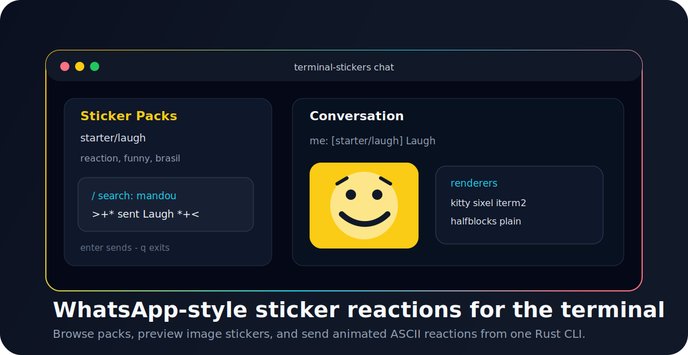

<p align="center">
  
</p>

<h1 align="center">terminal-stickers</h1>

<p align="center">
  WhatsApp-style sticker reactions for the terminal.
  Browse packs, preview images, send reactions, and play animated ASCII effects from one Rust CLI.
</p>

<p align="center">
  <a href="https://github.com/danielvictorino/terminal-stickers/actions/workflows/ci.yml"></a>
  <a href="./LICENSE"></a>
  
  
</p>

---

## Why

In Brazil, WhatsApp stickers are a language of their own: fast, funny, contextual images dropped into a conversation instead of another typed reply.

`terminal-stickers` brings that interaction pattern to CLI/TUI apps:

| Browse | Preview | Send | Animate |
| --- | --- | --- | --- |
| Local sticker packs | Terminal image rendering | Chat-style reaction flow | Native ASCII effects |
| Search by id, name, tag | Kitty, Sixel, iTerm2, ANSI | Lightweight TUI | Typewriter, wipe, glitch, burst |

---

## Install

### macOS and Linux

```sh
curl -fsSL https://raw.githubusercontent.com/danielvictorino/terminal-stickers/main/install.sh | sh
```

### Windows PowerShell

```powershell
irm https://raw.githubusercontent.com/danielvictorino/terminal-stickers/main/install.ps1 | iex
```

The installer downloads the latest GitHub Release for your OS and architecture, verifies the checksum when available, installs the binary, and places bundled starter packs beside it.

---

## Quick Start

```sh
terminal-stickers doctor
terminal-stickers list
terminal-stickers preview laugh
terminal-stickers animate "mandou bem" --effect burst
terminal-stickers chat
```

Use a repo-local or custom pack directory:

```sh
terminal-stickers --pack-dir ./packs list
terminal-stickers --pack-dir ./packs preview starter/laugh
terminal-stickers --pack-dir ./packs chat
```

---

## What It Looks Like

```text
+---------------------------------------------------------------+
| Terminal Stickers                  | Conversation              |
+------------------------------------+--------------------------+
| starter/laugh  Laugh               | >+* sent Laugh *+<        |
|   reaction, funny, brasil          | me: [starter/laugh] Laugh |
|                                    |                          |
| Search: /mandou                    |  [halfblock image render] |
+------------------------------------+--------------------------+
| enter sends    / searches    q exits                          |
+---------------------------------------------------------------+
```

Image preview fallback:

```text
starter/laugh -> packs/starter/stickers/laugh.ppm
################
####  ####  ####
################
##  ########  ##
####  ####  ####
```

Animated ASCII effects:

```sh
terminal-stickers animate "isso foi cinema" --effect typewriter
terminal-stickers animate "nao tankei" --effect wipe --fps 24
terminal-stickers animate "bugou tudo" --effect glitch --frames 48
terminal-stickers animate "mandou bem" --effect burst
```

---

## Commands

| Command | What it does |
| --- | --- |
| `terminal-stickers doctor` | Shows pack directory and detected renderer. |
| `terminal-stickers list` | Lists discovered packs and stickers. |
| `terminal-stickers preview <id-or-path>` | Renders a sticker in the terminal. |
| `terminal-stickers animate <text>` | Plays a native animated ASCII reaction. |
| `terminal-stickers chat` | Opens the sticker picker and chat TUI. |
| `terminal-stickers init-pack <name>` | Scaffolds a new sticker pack manifest. |

---

## Renderer Strategy

Terminal graphics are fragmented, so the project uses progressive rendering.

| Priority | Renderer | Best fit |
| --- | --- | --- |
| 1 | Kitty graphics | High-fidelity raster stickers in compatible terminals. |
| 2 | Sixel | Broad fallback, including modern Windows Terminal builds. |
| 3 | iTerm2 inline images | iTerm2 and compatible WezTerm setups. |
| 4 | ANSI half-blocks | Portable image approximation with truecolor. |
| 5 | Plain text | Last-resort placeholder that always works. |

The current `preview` command uses the portable half-block path. The renderer modules are structured so native protocol rendering can expand without changing sticker pack manifests.

---

## Sticker Packs

A pack is a folder with a `sticker-pack.toml` manifest and image files:

```toml
id = "starter"
name = "Starter Pack"
author = "terminal-stickers"
license = "CC0-1.0"
description = "A tiny sample pack used for local development and smoke tests."

[[stickers]]
id = "laugh"
name = "Laugh"
file = "stickers/laugh.ppm"
tags = ["reaction", "funny", "brasil"]
```

Create a new pack:

```sh
terminal-stickers --pack-dir ./packs init-pack "My Reactions"
```

Recommended asset shape:

| Asset | Recommendation |
| --- | --- |
| Static stickers | `512x512` transparent PNG or WebP |
| File size | Keep small for fast terminal rendering |
| Metadata | Use clear ids, names, tags, author, and license |
| Rights | Only contribute assets you can distribute |

---

## Architecture

```text
terminal-stickers/
|-- src/
|   |-- cli.rs          # clap commands and arguments
|   |-- manifest.rs     # sticker-pack.toml model
|   |-- packs.rs        # discovery, listing, lookup, init-pack
|   |-- render.rs       # renderer detection and half-block preview
|   |-- animation.rs    # native ASCII text effects
|   `-- tui.rs          # ratatui chat and picker UI
|-- packs/starter/      # bundled sample pack
|-- install.sh          # macOS/Linux release installer
|-- install.ps1         # Windows release installer
`-- .github/workflows/  # CI and release packaging
```

---

## Development

Requirements:

- Rust stable toolchain
- Git

Run locally:

```sh
cargo run -- doctor
cargo run -- --pack-dir ./packs list
cargo run -- --pack-dir ./packs preview laugh
cargo run -- animate "mandou bem" --effect burst
cargo run -- --pack-dir ./packs chat
```

Quality checks:

```sh
cargo fmt --check
cargo clippy --all-targets --all-features -- -D warnings
cargo test --all
```

---

## Contributing

Contributions are welcome. Useful contribution areas:

| Area | Examples |
| --- | --- |
| Renderers | Kitty, Sixel, iTerm2, tmux-safe behavior |
| Sticker packs | Public-domain or original reaction packs |
| Animation effects | Small deterministic Rust-native ASCII effects |
| Packaging | Homebrew, Scoop, Winget, Cargo release polish |
| TUI UX | Better picker navigation, recents, favorites, search |

Read [CONTRIBUTING.md](CONTRIBUTING.md) before opening a pull request.

---

## License

MIT. See [LICENSE](LICENSE).

Built for terminals that deserve better reactions.
